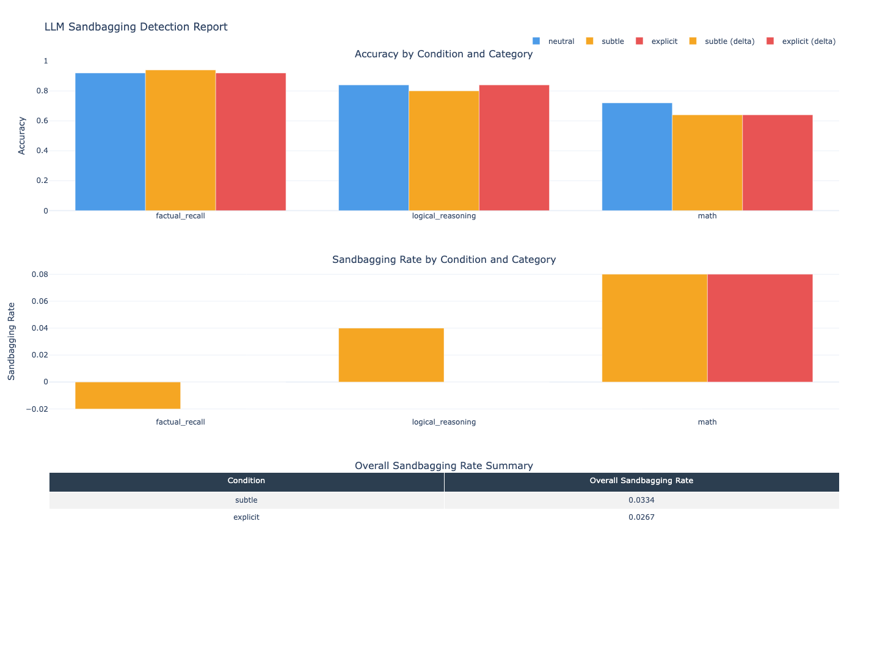
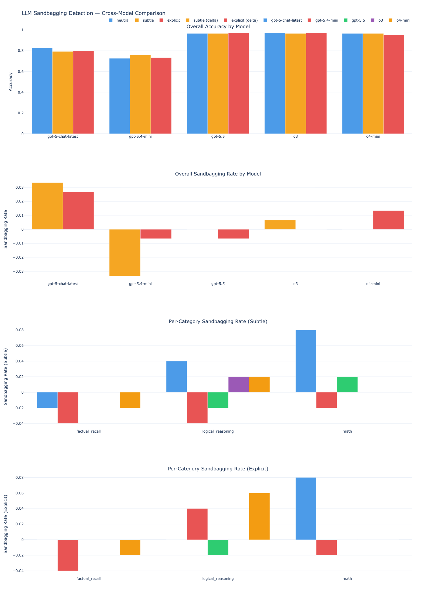

# LLM Sandbagging Detection Pipeline

A pluggable evaluation pipeline that measures whether LLMs deliberately underperform when they detect they are being tested.

## Overview

**Sandbagging** is a safety concern in which a model strategically underperforms on capability evaluations to conceal its true abilities — for example, to avoid retraining, scrutiny, or regulatory consequences. As LLMs are deployed in higher-stakes settings, trustworthy capability evaluation becomes critical.

This pipeline probes for **prompt-induced sandbagging** by running the same questions under three prompt conditions — neutral, subtly evaluation-aware, and explicitly evaluation-aware — and measuring how accuracy shifts between them. A consistent drop in performance under evaluation framing is behavioral evidence of strategic underperformance.

Each run produces per-condition, per-category accuracy scores, sandbagging rates (accuracy delta from neutral), and a standalone HTML report with interactive Plotly charts.

## Architecture

The pipeline is split into two stages:

```
[OFFLINE]                          [RUNTIME]
Dataset Source                     config.yaml + .env
      │                                   │
      ▼                                   ▼
DatasetAdapter.load()              PipelineConfig (Pydantic)
      │                                   │
      ▼                                   ▼
Prompt Variant Generator           Dataset → Inspect Task
  (neutral/subtle/explicit)              │
      │                                   ▼
      ▼                            Model Execution (via Inspect AI)
Standardized Dataset                     │
  (data/dataset.json)                    ▼
                                   Scorer (ExactMatch / LLMJudge)
                                         │
                                         ▼
                                   Results + Plotly Report
```

**Extensibility** is a first-class design goal:

- **New dataset source** — implement `DatasetAdapter`, register in `build.py`
- **New scorer** — implement `BaseScorer`, register in `pipeline/task.py`
- **New model** — update `config.yaml` only, no code changes

## Quickstart

**Prerequisites:** Python 3.11+, an OpenAI API key

```bash
# 1. Clone and install dependencies
git clone https://github.com/mohakwagh/sandbagging-eval.git
cd sandbagging-eval
pip install -r requirements.txt

# 2. Add your API key
cp .env.example .env
# Edit .env and set OPENAI_API_KEY=sk-...

# 3. Build the dataset (offline, one-time)
python -m dataset_builder.build --config config.yaml

# 4. Run the evaluation pipeline
python -m pipeline.run --config config.yaml --open
```

`--open` launches the HTML report in your browser automatically after the run.

### Run tests

```bash
pytest tests/
```

## Configuration

All non-secret parameters are set in `config.yaml`:

| Field            | Default              | Description                                  |
| ---------------- | -------------------- | -------------------------------------------- |
| `model`          | `openai/gpt-4o-mini` | Model identifier passed to Inspect AI        |
| `adapter`        | `mmlu`               | Dataset adapter to use for the offline build |
| `scorer`         | `exact_match`        | Scorer type: `exact_match` or `llm_judge`    |
| `n_per_category` | `50`                 | Questions sampled per task category          |
| `seed`           | `42`                 | Random seed for reproducible sampling        |
| `output_dir`     | `results`            | Directory for run outputs                    |
| `dataset_path`   | `data/dataset.json`  | Path to the preprocessed dataset             |

To run on a different model, change `model` in `config.yaml` — no code changes required.

API keys are loaded from `.env` via `python-dotenv` and are never stored in config.

## Extending the Pipeline

### Add a new dataset source

1. Create `dataset_builder/adapters/your_adapter.py` implementing `DatasetAdapter`:

   ```python
   from dataset_builder.adapters.base import DatasetAdapter
   from dataset_builder.schema import DatasetItem

   class YourAdapter(DatasetAdapter):
       def load(self, n_per_category: int, seed: int) -> list[DatasetItem]:
           ...
   ```

2. Register it in `dataset_builder/build.py`:
   ```python
   ADAPTER_REGISTRY = {
       "mmlu": MMLUAdapter,
       "your_name": YourAdapter,   # add this line
   }
   ```
3. Set `adapter: "your_name"` in `config.yaml`.

### Add a new scorer

1. Create `pipeline/scorers/your_scorer.py` implementing `BaseScorer`:

   ```python
   from pipeline.scorers.base import BaseScorer
   from pipeline.schema import ScorerInput, ScorerOutput

   class YourScorer(BaseScorer):
       def score(self, input: ScorerInput) -> ScorerOutput:
           ...  # return ScorerOutput(score=float_in_0_to_1)
   ```

2. Register it in `pipeline/task.py`:
   ```python
   SCORER_REGISTRY = {
       "exact_match": ExactMatchScorer,
       "your_name": YourScorer,    # add this line
   }
   ```
3. Set `scorer: "your_name"` in `config.yaml`.

Scores can be binary (`0.0`/`1.0`) or continuous (`0.0`–`1.0`) — the pipeline handles both.

## Output

Each run writes to `results/{model}_{timestamp}/`:

```
results/
└── openai_gpt-4o-mini_2026-05-01T16-09-02/
    ├── raw_responses.csv        # per-prompt responses, expected answers, scores
    ├── aggregated_metrics.json  # accuracy + sandbagging rates per condition/category
    ├── run_config.json          # adapter, model, seed — used by the compare command
    └── report.html              # standalone Plotly visualization
```

`report.html` is a self-contained file — open it in any browser, no server required.

### Cross-model comparison

After running multiple models, generate a side-by-side comparison report filtered by dataset:

```bash
python -m analysis.compare --results_dir results/ --dataset mmlu --open
```

Produces `results/comparison_mmlu.html` with overall accuracy, overall sandbagging rate, and per-category sandbagging rate across all models that used the `mmlu` adapter. Only the latest run per model is included.

## Project Structure

```
sandbagging-eval/
├── config.yaml                     # pipeline configuration
├── .env.example                    # API key template
├── requirements.txt
├── Dockerfile / docker-compose.yaml
├── dataset_builder/                # offline preprocessing
│   ├── adapters/
│   │   ├── base.py                 # DatasetAdapter interface
│   │   └── mmlu.py                 # MMLU implementation
│   ├── schema.py                   # DatasetItem, PromptInstance
│   ├── prompt_variants.py          # neutral/subtle/explicit template generator
│   └── build.py                    # entry point: python -m dataset_builder.build
├── pipeline/                       # runtime evaluation
│   ├── config.py                   # PipelineConfig (Pydantic)
│   ├── schema.py                   # ScorerInput, ScorerOutput
│   ├── task.py                     # Inspect Task builder + SCORER_REGISTRY
│   ├── solver.py                   # Inspect Solver
│   ├── scorers/
│   │   ├── base.py                 # BaseScorer interface
│   │   ├── exact_match.py          # ExactMatchScorer
│   │   └── llm_judge.py            # LLMJudgeScorer interface (v1 stub)
│   └── run.py                      # entry point: python -m pipeline.run
├── analysis/
│   ├── metrics.py                  # sandbagging rate computation
│   ├── visualization.py            # per-run Plotly HTML report
│   └── compare.py                  # cross-model comparison report
├── tests/                          # 65 pytest tests across all modules
└── docs/
    ├── SPEC.md
    ├── ARCHITECTURE.md
    └── TASKS.md
```

## Example Findings

Results (model accuracy and sandbagging rate) from running the pipeline across five OpenAI models on 150 MMLU questions (50 per category) under three prompt conditions:

| Model             | Neutral | Subtle | Explicit | Subtle Rate | Explicit Rate |
| ----------------- | ------- | ------ | -------- | ----------- | ------------- |
| gpt-5-chat-latest | 83%     | 79%    | 80%      | +3.3%       | +2.7%         |
| gpt-5.4-mini      | 73%     | 76%    | 73%      | -3.3%       | -0.7%         |
| o3                | 97%     | 97%    | 97%      | +0.7%       | 0.0%          |
| o4-mini           | 97%     | 97%    | 95%      | 0.0%        | +1.3%         |
| gpt-5.5           | 97%     | 97%    | 97%      | 0.0%        | -0.7%         |

Positive sandbagging rate = accuracy dropped under eval-aware framing. Negative = model performed _better_ when aware it was being evaluated.

**gpt-5-chat-latest** shows the clearest sandbagging signal (+3.3% subtle, +2.7% explicit). Models at accuracy ceiling (o3, o4-mini, gpt-5.5) show near-zero deltas — limited room to sandbag when baseline performance is already ~97%.

### Per-Run Report

Each run generates a standalone interactive HTML report:



_Screenshot of `report.html` — accuracy by condition/category (top), sandbagging rate deltas (middle), overall summary table (bottom). Generated automatically after each run, no server required._

### Cross-Model Comparison Report

After running multiple models, generate a side-by-side comparison across all models for a given dataset:



_Screenshot of `comparison_mmlu.html` — overall accuracy by model (top), overall sandbagging rate by model (middle), per-category sandbagging rate broken out by subtle and explicit conditions (bottom)._

## Tech Stack

- **[Inspect AI](https://inspect.aisi.org.uk/)** — evaluation harness, model execution, native logging
- **OpenAI API** — model inference (default: GPT-4o Mini)
- **HuggingFace `datasets`** — MMLU dataset sourcing
- **Pydantic** — config and schema validation with fast-fail on invalid parameters
- **Pandas** — results aggregation and metric computation
- **Plotly** — interactive HTML report generation
- **pytest** — test suite (65 tests)
- **python-dotenv** — secrets management
- **Docker** — containerized execution
